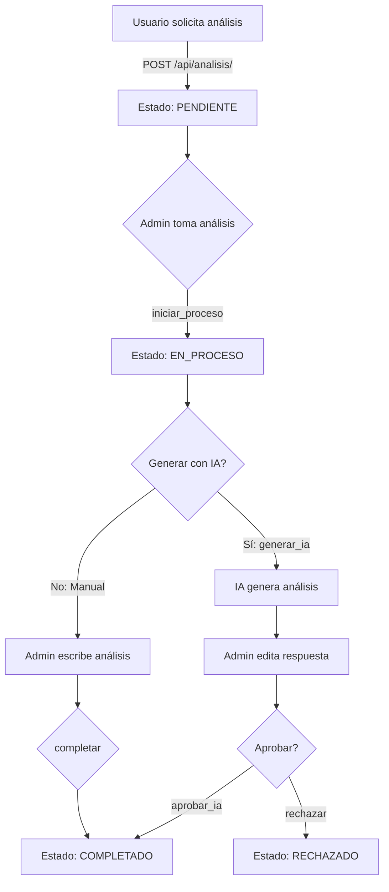

# Módulo de Análisis Urbanístico

## 📋 Tabla de Contenidos

- [Descripción General](#descripción-general)
- [Modelos](#modelos)
- [Serializers](#serializers)
- [Vistas (Views)](#vistas-views)
- [Servicios (Services)](#servicios-services)
- [URLs](#urls)
- [Permisos y Validaciones](#permisos-y-validaciones)
- [Flujo de Trabajo](#flujo-de-trabajo)
- [Ejemplos de Uso](#ejemplos-de-uso)

---

## Descripción General

El módulo de **Análisis Urbanístico** permite a propietarios de lotes y desarrolladores solicitar análisis detallados sobre el aprovechamiento urbanístico de un lote según el POT (Plan de Ordenamiento Territorial) de Medellín.

### Características Principales

- ✅ **Solicitud de Análisis**: Propietarios pueden solicitar análisis de sus lotes, desarrolladores de cualquier lote
- 🤖 **Generación con IA**: Integración con Gemini AI (Google) para generar análisis automáticos
- 📊 **Múltiples Tipos**: Máximo potencial, factibilidad, normativa, financiero
- 🏠 **Soporte VIS**: Opción para incluir Vivienda de Interés Social
- 📝 **Revisión Manual**: Admins pueden editar y aprobar análisis generados por IA
- 📈 **Seguimiento de Estado**: Pendiente → En Proceso → Completado/Rechazado

---

## Modelos

### `AnalisisUrbanistico`

Modelo principal que representa una solicitud de análisis urbanístico.

**Ubicación**: `apps/analisis/models.py`

#### Campos Principales

| Campo | Tipo | Descripción |
|-------|------|-------------|
| `id` | UUID | Identificador único |
| `lote` | FK(Lote) | Lote a analizar |
| `solicitante` | FK(User) | Usuario que solicita el análisis |
| `analista` | FK(User) | Admin asignado (opcional) |
| `tipo_analisis` | CharField | Tipo: maximo_potencial, factibilidad, normativa, financiero |
| `incluir_vis` | Boolean | Si incluye VIS |
| `estado` | CharField | Estado: pendiente, en_proceso, completado, rechazado |
| `resultados` | JSONField | Resultados del análisis |
| `observaciones_analista` | TextField | Notas del analista |
| `comentarios_solicitante` | TextField | Comentarios iniciales |
| `created_at` | DateTime | Fecha de creación |
| `fecha_inicio_proceso` | DateTime | Cuándo se inició |
| `fecha_completado` | DateTime | Cuándo se completó |

#### Métodos Importantes

```python
# Iniciar análisis (cambia estado a en_proceso)
analisis.iniciar_proceso(analista=admin_user)

# Completar análisis
analisis.completar(
    resultados={'aprovechamiento': 500, ...},
    observaciones='Cumple normativa POT'
)

# Rechazar análisis
analisis.rechazar(motivo='Faltan documentos')

# Propiedades útiles
analisis.esta_pendiente    # Boolean
analisis.esta_en_proceso   # Boolean
analisis.esta_completado   # Boolean
analisis.tiempo_procesamiento  # timedelta
```

#### Validaciones en `clean()`

```python
def clean(self):
    """Validaciones del modelo"""
    if self.lote and self.solicitante:
        user = self.solicitante
        
        # ✅ Propietarios solo pueden analizar sus lotes
        if user.role == 'owner':
            if self.lote.owner != user:
                raise ValidationError({
                    'lote': 'Solo puedes solicitar análisis para tus propios lotes'
                })
        
        # ✅ Desarrolladores pueden analizar CUALQUIER lote
        # ✅ Admins sin restricciones
```

---

### `ParametroUrbanistico`

Parámetros del POT que la IA usa para generar análisis.

**Ubicación**: `apps/analisis/models.py`

#### Campos

| Campo | Tipo | Descripción |
|-------|------|-------------|
| `categoria` | CharField | Categoría: area_minima, indices, retiros, alturas, etc. |
| `nombre` | CharField | Nombre del parámetro |
| `descripcion` | TextField | Descripción detallada para IA |
| `datos` | JSONField | Datos estructurados del parámetro |
| `articulo_pot` | CharField | Artículo del POT (opcional) |
| `activo` | Boolean | Si está activo |
| `orden` | Integer | Orden de visualización |

#### Ejemplo de Uso

```python
# Crear parámetro
param = ParametroUrbanistico.objects.create(
    categoria='indices',
    nombre='Índice de Construcción',
    descripcion='IC máximo permitido según tratamiento',
    datos={
        'consolidacion_nivel_1': 3.0,
        'consolidacion_nivel_2': 4.0,
        'desarrollo': 5.0
    },
    articulo_pot='Art. 123',
    activo=True,
    orden=1
)
```

---

### `RespuestaIA`

Almacena respuestas generadas por Gemini AI.

**Ubicación**: `apps/analisis/models.py`

#### Campos

| Campo | Tipo | Descripción |
|-------|------|-------------|
| `analisis` | FK(AnalisisUrbanistico) | Análisis relacionado |
| `prompt` | TextField | Prompt enviado a la IA |
| `respuesta` | TextField | Respuesta generada |
| `modelo_ia` | CharField | Modelo usado (gemini-2.5-flash) |
| `tokens_usados` | Integer | Tokens consumidos |
| `tiempo_respuesta` | Float | Segundos que tardó |
| `revisado_por` | FK(User) | Admin que revisó (opcional) |
| `aprobado` | Boolean | Si fue aprobado |
| `notas_revision` | TextField | Notas del revisor |

---

## Serializers

### `AnalisisUrbanisticoSerializer`

Serializer completo para lectura.

**Ubicación**: `apps/analisis/serializers.py`

#### Campos Incluidos

```python
fields = [
    'id', 'lote', 'lote_info',  # Info del lote
    'solicitante', 'solicitante_info',  # Info del solicitante
    'analista', 'analista_info',  # Info del analista
    'tipo_analisis', 'tipo_analisis_display',
    'incluir_vis', 'comentarios_solicitante',
    'estado', 'estado_display',
    'resultados', 'observaciones_analista', 'archivo_informe',
    'created_at', 'updated_at',
    'fecha_inicio_proceso', 'fecha_completado',
    'tiempo_procesamiento_display',
    'esta_pendiente', 'esta_en_proceso', 'esta_completado',
    'metadatos'
]
```

#### Ejemplo de Respuesta

```json
{
  "id": "uuid",
  "lote_info": {
    "id": "lote-uuid",
    "nombre": "Lote Centro",
    "direccion": "Calle 50 #50-50",
    "area": 500.0,
    "cbml": "01234567890"
  },
  "solicitante_info": {
    "id": "user-uuid",
    "email": "user@example.com",
    "full_name": "Juan Pérez"
  },
  "tipo_analisis": "maximo_potencial",
  "tipo_analisis_display": "Máximo Potencial",
  "incluir_vis": false,
  "estado": "completado",
  "estado_display": "Completado",
  "resultados": {
    "aprovechamiento_maximo": 2500.0,
    "numero_pisos": 5,
    ...
  },
  "created_at": "2024-01-15T10:00:00Z",
  "fecha_completado": "2024-01-16T15:30:00Z",
  "tiempo_procesamiento_display": "1 días, 5 horas"
}
```

---

### `AnalisisCreateSerializer`

Para crear análisis (solo campos requeridos).

**Ubicación**: `apps/analisis/serializers.py`

#### Campos

```python
fields = [
    'lote',  # UUID del lote
    'tipo_analisis',  # maximo_potencial, factibilidad, etc.
    'incluir_vis',  # Boolean
    'comentarios_solicitante'  # Texto opcional
]
```

#### Validación de Lote

```python
def validate_lote(self, value):
    """
    - Propietarios: Solo sus lotes
    - Desarrolladores: Cualquier lote
    - Admins: Sin restricciones
    """
    user = self.context['request'].user
    
    if user.role == 'owner' and value.owner != user:
        raise ValidationError("Solo puedes solicitar análisis para tus propios lotes")
    
    # Desarrolladores y admins sin restricciones
    return value
```

#### Ejemplo de Request

```json
{
  "lote": "lote-uuid",
  "tipo_analisis": "maximo_potencial",
  "incluir_vis": false,
  "comentarios_solicitante": "Necesito saber el aprovechamiento máximo"
}
```

---

## Vistas (Views)

### `AnalisisUrbanisticoViewSet`

ViewSet principal con todas las operaciones.

**Ubicación**: `apps/analisis/views.py`

#### Endpoints Disponibles

| Método | Endpoint | Descripción | Permisos |
|--------|----------|-------------|----------|
| GET | `/api/analisis/` | Listar análisis | Authenticated |
| POST | `/api/analisis/` | Crear análisis | Authenticated |
| GET | `/api/analisis/{id}/` | Detalle de análisis | Authenticated |
| PATCH | `/api/analisis/{id}/` | Actualizar análisis | Admin |
| DELETE | `/api/analisis/{id}/` | Eliminar análisis | Admin |
| GET | `/api/analisis/mis_analisis/` | Análisis del usuario | Authenticated |
| GET | `/api/analisis/estadisticas/` | Estadísticas generales | Admin |
| POST | `/api/analisis/{id}/iniciar_proceso/` | Iniciar análisis | Admin |
| POST | `/api/analisis/{id}/completar/` | Completar análisis | Admin |
| POST | `/api/analisis/{id}/rechazar/` | Rechazar análisis | Admin |
| POST | `/api/analisis/{id}/generar_ia/` | Generar con IA | Admin |
| POST | `/api/analisis/{id}/aprobar_ia/` | Aprobar respuesta IA | Admin |

---

#### `GET /api/analisis/` - Listar Análisis

**Permisos**: Authenticated

**Query Params**:
- `estado`: Filtrar por estado (pendiente, en_proceso, completado, rechazado)
- `tipo_analisis`: Filtrar por tipo
- `lote`: UUID del lote
- `search`: Buscar por nombre de lote o dirección
- `ordering`: Ordenar (-created_at, estado, tipo_analisis)

**Filtrado por Usuario**:
- **Admin**: Ve todos los análisis
- **Owner/Developer**: Solo sus propios análisis

**Ejemplo Request**:
```bash
GET /api/analisis/?estado=pendiente&ordering=-created_at
```

**Ejemplo Response**:
```json
{
  "count": 25,
  "next": "http://api/analisis/?page=2",
  "previous": null,
  "results": [
    {
      "id": "uuid",
      "lote_info": {...},
      "tipo_analisis": "maximo_potencial",
      "estado": "pendiente",
      ...
    }
  ]
}
```

---

#### `POST /api/analisis/` - Crear Análisis

**Permisos**: Authenticated

**Request Body**:
```json
{
  "lote": "lote-uuid",
  "tipo_analisis": "maximo_potencial",
  "incluir_vis": false,
  "comentarios_solicitante": "Comentarios opcionales"
}
```

**Validaciones**:
- ✅ Propietarios solo pueden analizar sus lotes
- ✅ Desarrolladores pueden analizar cualquier lote
- ✅ Tipo de análisis debe ser válido

**Response Success (201)**:
```json
{
  "id": "nuevo-uuid",
  "lote": "lote-uuid",
  "solicitante": "user-uuid",
  "tipo_analisis": "maximo_potencial",
  "estado": "pendiente",
  "created_at": "2024-01-15T10:00:00Z",
  ...
}
```

**Response Error (400)**:
```json
{
  "lote": ["Solo puedes solicitar análisis para tus propios lotes"]
}
```

---

#### `POST /api/analisis/{id}/iniciar_proceso/` - Iniciar Análisis

**Permisos**: Admin

**Descripción**: Admin toma el análisis y lo pone en proceso.

**Request Body**: Vacío

**Response Success**:
```json
{
  "success": true,
  "message": "Análisis iniciado correctamente",
  "analisis": {
    "id": "uuid",
    "estado": "en_proceso",
    "analista": "admin-uuid",
    "fecha_inicio_proceso": "2024-01-15T11:00:00Z",
    ...
  }
}
```

**Response Error (400)**:
```json
{
  "success": false,
  "error": "Solo se pueden iniciar análisis pendientes"
}
```

---

#### `POST /api/analisis/{id}/generar_ia/` - Generar con IA

**Permisos**: Admin

**Descripción**: Genera análisis automático usando Gemini AI. **NO guarda en BD**, solo retorna JSON.

**Request Body**: Vacío

**Response Success**:
```json
{
  "success": true,
  "message": "Análisis generado con IA",
  "data": {
    "respuesta": "# Análisis Urbanístico\n\n## Viabilidad Normativa...",
    "modelo": "gemini-2.5-flash",
    "tokens_usados": 3542,
    "tiempo_respuesta": 4.23,
    "prompt": "Eres un experto urbanista..."
  }
}
```

**Flujo**:
1. Si está `pendiente` → cambia a `en_proceso`
2. Construye prompt con datos del lote + parámetros POT
3. Envía a Gemini AI
4. Guarda en tabla `RespuestaIA` (NO en `analisis.resultados`)
5. Retorna respuesta al frontend

**Importante**: El admin debe **editar y aprobar** antes de guardar.

---

#### `POST /api/analisis/{id}/aprobar_ia/` - Aprobar Respuesta IA

**Permisos**: Admin

**Descripción**: Guarda la respuesta editada en `analisis.resultados` y marca como completado.

**Request Body**:
```json
{
  "respuesta_ia": "# Análisis editado...",
  "notas_revision": "Ajusté los cálculos de IC",
  "metadata": {
    "modelo": "gemini-2.5-flash",
    "tokens_usados": 3542,
    "tiempo_respuesta": 4.23
  }
}
```

**Response Success**:
```json
{
  "success": true,
  "intent": "aprobar_ia",
  "message": "Análisis aprobado y guardado exitosamente"
}
```

**Qué Hace**:
1. Valida que `respuesta_ia` no esté vacía
2. Guarda en `analisis.resultados`:
   ```json
   {
     "generado_con_ia": true,
     "respuesta_ia": "texto completo",
     "modelo_ia": "gemini-2.5-flash",
     "tokens": 3542,
     "aprobado_por": "admin@example.com",
     "fecha_aprobacion": "2024-01-15T15:00:00Z",
     "notas_revision": "...",
     "editado": true
   }
   ```
3. Cambia `estado` a `completado`
4. Marca `fecha_completado`

---

#### `POST /api/analisis/{id}/rechazar/` - Rechazar Análisis

**Permisos**: Admin

**Request Body**:
```json
{
  "motivo": "Faltan documentos del lote"
}
```

**Response Success**:
```json
{
  "success": true,
  "message": "Análisis rechazado"
}
```

---

#### `GET /api/analisis/mis_analisis/` - Mis Análisis

**Permisos**: Authenticated

**Descripción**: Retorna análisis del usuario actual (filtrado automático por `solicitante`).

**Response**:
```json
{
  "count": 5,
  "results": [
    {
      "id": "uuid",
      "lote_info": {...},
      "tipo_analisis": "maximo_potencial",
      "estado": "completado",
      ...
    }
  ]
}
```

---

#### `GET /api/analisis/estadisticas/` - Estadísticas

**Permisos**: Admin

**Response**:
```json
{
  "total": 150,
  "pendientes": 10,
  "en_proceso": 5,
  "completados": 130,
  "rechazados": 5,
  "por_tipo": {
    "maximo_potencial": {
      "label": "Máximo Potencial",
      "count": 80
    },
    "factibilidad": {
      "label": "Factibilidad",
      "count": 40
    },
    ...
  }
}
```

---

## Servicios (Services)

### `GeminiAnalysisService`

Servicio para generar análisis con Gemini AI.

**Ubicación**: `apps/analisis/services.py`

#### Métodos

##### `__init__()`

Inicializa el modelo de Gemini.

```python
service = GeminiAnalysisService()
# Usa: gemini-2.5-flash (o gemini-2.5-pro como fallback)
```

---

##### `construir_prompt(analisis)`

Construye el prompt estructurado para la IA.

**Parámetros**:
- `analisis`: Instancia de `AnalisisUrbanistico`

**Retorna**: String con el prompt completo

**Estructura del Prompt**:
```markdown
Eres un experto urbanista especializado en análisis de aprovechamiento urbanístico en Medellín, Colombia.

# INFORMACIÓN DEL LOTE
- CBML: 01234567890
- Dirección: Calle 50 #50-50
- Área: 500 m²
- Barrio: Centro
- Estrato: 4
- Clasificación del suelo: Urbano
- Uso del suelo: Residencial
- Tratamiento POT: Consolidación Nivel 2

# TIPO DE ANÁLISIS SOLICITADO
Máximo Potencial

# INCLUYE VIS (Vivienda de Interés Social)
# NO incluye VIS

# COMENTARIOS DEL SOLICITANTE
Necesito saber el aprovechamiento máximo

# PARÁMETROS URBANÍSTICOS DEL POT DE MEDELLÍN
## Índices Urbanísticos - Índice de Construcción
Descripción del parámetro...
Artículo: Art. 123
Datos: {"consolidacion_nivel_2": 4.0}

...más parámetros...

# INSTRUCCIONES
Por favor, realiza un análisis urbanístico detallado considerando:
1. VIABILIDAD NORMATIVA
2. APROVECHAMIENTO MÁXIMO
3. RESTRICCIONES
4. ÁREAS MÍNIMAS
5. RECOMENDACIONES
6. COSTOS ESTIMADOS

...
```

---

##### `generar_analisis(analisis)`

Genera análisis y guarda en BD.

**Parámetros**:
- `analisis`: Instancia de `AnalisisUrbanistico`

**Retorna**: `RespuestaIA`

**Proceso**:
1. Construye prompt
2. Configura generación (temperature=0.7, max_tokens=8192)
3. Desactiva safety filters
4. Envía a Gemini
5. Guarda en tabla `RespuestaIA`
6. Retorna instancia

**Ejemplo de Uso**:
```python
service = GeminiAnalysisService()
respuesta_ia = service.generar_analisis(analisis)

print(respuesta_ia.respuesta)  # Texto del análisis
print(respuesta_ia.tokens_usados)  # Ej: 3542
print(respuesta_ia.tiempo_respuesta)  # Ej: 4.23 segundos
```

---

##### `regenerar_analisis(respuesta_ia, notas_adicionales)`

Regenera análisis con notas adicionales del admin.

**Parámetros**:
- `respuesta_ia`: Instancia de `RespuestaIA` existente
- `notas_adicionales`: String con comentarios adicionales

**Retorna**: `RespuestaIA` actualizada

**Uso**:
```python
nueva_respuesta = service.regenerar_analisis(
    respuesta_ia=respuesta_anterior,
    notas_adicionales="Por favor enfócate más en el tema de VIS"
)
```

---

## URLs

**Ubicación**: `apps/analisis/urls.py`

```python
from django.urls import path, include
from rest_framework.routers import DefaultRouter
from . import views

app_name = 'analisis'

router = DefaultRouter()
router.register(r'', views.AnalisisUrbanisticoViewSet, basename='analisis')

urlpatterns = [
    path('', include(router.urls)),
    # Endpoint adicional para parámetros
    path('parametros/', views.parametros_urbanisticos_view, name='parametros-urbanisticos'),
]
```

**Endpoints Generados**:
- `POST /api/analisis/` → Crear
- `GET /api/analisis/` → Listar
- `GET /api/analisis/{id}/` → Detalle
- `PATCH /api/analisis/{id}/` → Actualizar
- `DELETE /api/analisis/{id}/` → Eliminar
- `POST /api/analisis/{id}/iniciar_proceso/` → Custom action
- `POST /api/analisis/{id}/generar_ia/` → Custom action
- `POST /api/analisis/{id}/aprobar_ia/` → Custom action
- ...

---

## Permisos y Validaciones

### Permisos por Rol

| Acción | Owner | Developer | Admin |
|--------|-------|-----------|-------|
| **Crear análisis** | ✅ Solo sus lotes | ✅ Cualquier lote | ✅ Cualquier lote |
| **Ver análisis** | ✅ Solo suyos | ✅ Solo suyos | ✅ Todos |
| **Iniciar proceso** | ❌ | ❌ | ✅ |
| **Generar IA** | ❌ | ❌ | ✅ |
| **Aprobar IA** | ❌ | ❌ | ✅ |
| **Completar** | ❌ | ❌ | ✅ |
| **Rechazar** | ❌ | ❌ | ✅ |

### Validaciones Automáticas

#### En Serializer (`validate_lote`)

```python
def validate_lote(self, value):
    user = self.context['request'].user
    
    # Propietarios: Solo sus lotes
    if user.role == 'owner' and value.owner != user:
        raise ValidationError("Solo puedes solicitar análisis para tus propios lotes")
    
    # Desarrolladores y admins: Sin restricciones
    return value
```

#### En Modelo (`clean`)

```python
def clean(self):
    if self.solicitante.role == 'owner':
        if self.lote.owner != self.solicitante:
            raise ValidationError({
                'lote': 'Solo puedes solicitar análisis para tus propios lotes'
            })
```

---

## Flujo de Trabajo

### Flujo Completo de Análisis



### Estados del Análisis

