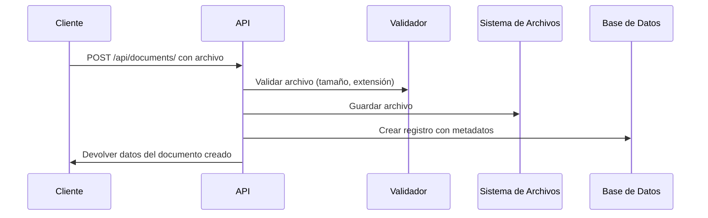

# Documentación Técnica: Módulo de Documentos

## Arquitectura y Componentes

El módulo de documentos sigue una arquitectura REST basada en Django y Django REST Framework. A continuación se detallan los componentes principales:

### 1. Modelo de Datos

```python
class Document(models.Model):
    title = models.CharField("Título", max_length=255)
    description = models.TextField("Descripción", blank=True, null=True)
    file = models.FileField("Archivo", upload_to=document_upload_path)
    document_type = models.CharField("Tipo de documento", max_length=50, choices=DOCUMENT_TYPES, default='general')
    
    # Relaciones
    user = models.ForeignKey(User, on_delete=models.CASCADE, related_name='documents')
    lote = models.ForeignKey('lotes.Lote', on_delete=models.CASCADE, related_name='documents', null=True, blank=True)
    
    # Metadatos
    created_at = models.DateTimeField("Fecha de creación", auto_now_add=True)
    updated_at = models.DateTimeField("Última actualización", auto_now=True)
    file_size = models.PositiveIntegerField("Tamaño del archivo (bytes)", default=0)
    mime_type = models.CharField("Tipo MIME", max_length=100, blank=True, null=True)
    tags = models.JSONField("Etiquetas", default=list, blank=True)
    metadata = models.JSONField("Metadatos adicionales", default=dict, blank=True)
    is_active = models.BooleanField("Activo", default=True)
```

### 2. Serializadores

#### DocumentSerializer (Lectura general)
- Convierte instancias de Document a JSON y viceversa
- Incluye campos virtuales como `file_url`, `file_name` y `user_name`

#### DocumentUploadSerializer (Creación y edición)
- Validaciones específicas para la subida de archivos
- Verifica la existencia de entidades relacionadas (lotes)

### 3. Vistas y ViewSets

#### DocumentViewSet
- Proporciona operaciones CRUD completas
- Gestiona permisos basados en propiedad de los documentos
- Incluye acciones personalizadas: `upload`, `download` y `archive`

#### Vistas adicionales
- `user_documents`: Lista documentos del usuario actual
- `lote_documents`: Lista documentos de un lote específico

### 4. Seguridad y Permisos

- Clase `IsOwnerOrAdmin`: Solo permite acceso al propietario o administradores
- Validación de tokens JWT para todas las operaciones
- Validaciones en archivos (tamaño, extensión, nombre)

## Integraciones con el Sistema

### 1. Almacenamiento de Archivos

Los archivos se almacenan en el sistema de archivos mediante la configuración MEDIA_ROOT de Django. La estructura de carpetas es:
```
media/
└── documents/
    └── YYYY/
        └── MM/
            └── DD/
                └── {uuid}.{extension}
```

### 2. Integración con el Módulo de Lotes

Los documentos pueden asociarse con lotes mediante el campo `lote` (ForeignKey).

## Flujos de Trabajo

### 1. Subida de un Documento



### 2. Procesamiento de Metadatos

Al subir un archivo, se extraen automáticamente:
- Tamaño del archivo
- Tipo MIME basado en extensión
- Nombre de archivo original

## Endpoints API (Detalles técnicos)

### Documentos

```
POST   /api/documents/              # Crear un documento
GET    /api/documents/              # Listar documentos (filtrable)
GET    /api/documents/{id}/         # Obtener un documento
PUT    /api/documents/{id}/         # Actualizar un documento (completo)
PATCH  /api/documents/{id}/         # Actualizar un documento (parcial)
DELETE /api/documents/{id}/         # Eliminar un documento
```

### Acciones adicionales

```
POST   /api/documents/upload/       # Endpoint específico para subir
GET    /api/documents/{id}/download/ # Obtener URL de descarga
POST   /api/documents/{id}/archive/ # Archivar documento (soft delete)
GET    /api/documents/types/        # Listar tipos de documentos
```

### Documentos por contexto

```
GET    /api/documents/user/         # Documentos del usuario actual
GET    /api/documents/lote/{id}/    # Documentos de un lote específico
```

## Formatos de Peticiones y Respuestas

### Subida de Documento (POST /api/documents/)

**Solicitud**:
- Content-Type: `multipart/form-data`
- Campos según el modelo Document

**Respuesta** (201 Created):
- Datos completos del documento creado
- URL del archivo para descarga

### Listado de Documentos (GET /api/documents/)

**Solicitud**:
- Query params: `document_type`, `lote`, `ordering`, etc.

**Respuesta** (200 OK):
- Lista paginada de documentos
- Cada documento incluye datos básicos y URL para descarga

## Validaciones

### Archivo
- **Tamaño máximo**: 50MB
- **Extensiones permitidas**: Lista configurable de extensiones
- **Nombre**: Restricciones de caracteres y longitud

### Metadatos
- **Tipos de documento**: Lista predefinida de tipos válidos
- **Relaciones**: Verificación de existencia de lotes referenciados

## Consideraciones para Producción

### Almacenamiento
- Considerar un almacenamiento externo como S3 para archivos
- Configurar `DEFAULT_FILE_STORAGE` en settings.py

### Seguridad
- Aplicar límites de frecuencia (rate limiting)
- Implementar escaneo de virus/malware para archivos subidos

### Rendimiento
- Optimizar consultas para listas largas de documentos
- Implementar paginación adecuada

## Extensiones Futuras

- Implementación de versiones de documentos
- Integración con herramientas de visualización para formatos específicos
- Sistema de compartición de documentos con permisos granulares
- Búsqueda de texto completo en documentos indexados
- Integración con servicios de OCR para documentos escaneados

---

Esta documentación es para uso interno de desarrolladores. Para la guía de usuario final, consulte `guia_uso_documentos.md`.